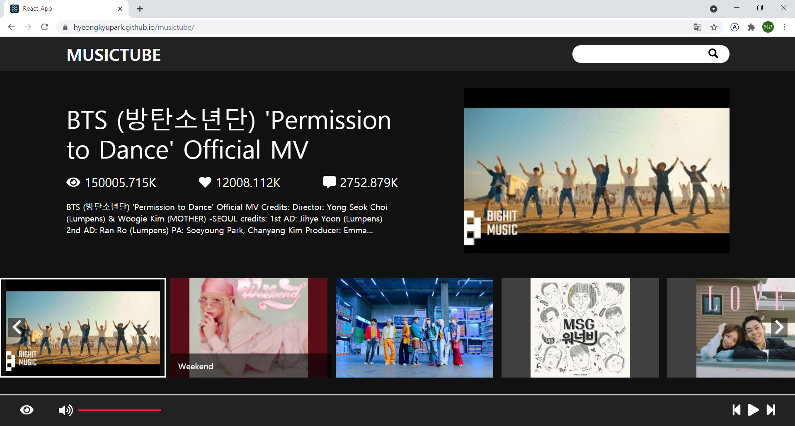

# Musictube 프로젝트
## 사용기술
- 프론트 : React, Typescript, redux, redux-saga, redux-toolkit, styled-components, react-youtube
- API : YouTube Data API
- 기타 : git, gihub pages

#
## musictube 란?
- 유튜브의 영상들 중에서 음악에 해당하는 영상을 검색하고 플레이할 수 있는 어플리케이션입니다.
- 유튜브 API를 활용하여 제작한 간단한 어플리케이션 입니다.
- 개발 진행중이며, 추가할 기능으로는 플레이 리스트 기능과 러닝타임 프로그래스바 기능이 있습니다.

#
### <메인 페이지>

- 디자인은 넷플릭스 메인 페이지를 모티브로 하였고, 영상 제목과 조회수, 좋아요수, 댓글수를 불러와 표시하였습니다.
 
 
 

### <영상 보기/숨기기>

- 하단 컨트롤러의 눈동자 아이콘을 클릭하여 유튜브 영상을 on/off 할 수 있습니다.
 
 
 

### <검색 기능>

- 특정 검색어로 검색하여 영상을 찾을 수 있습니다.
